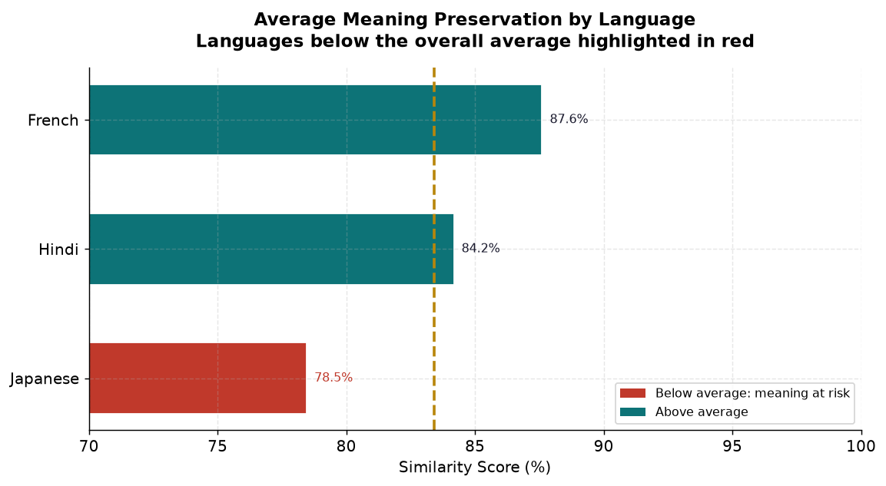
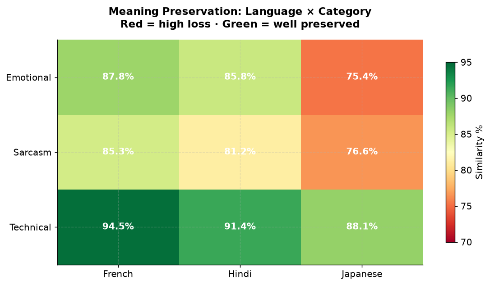
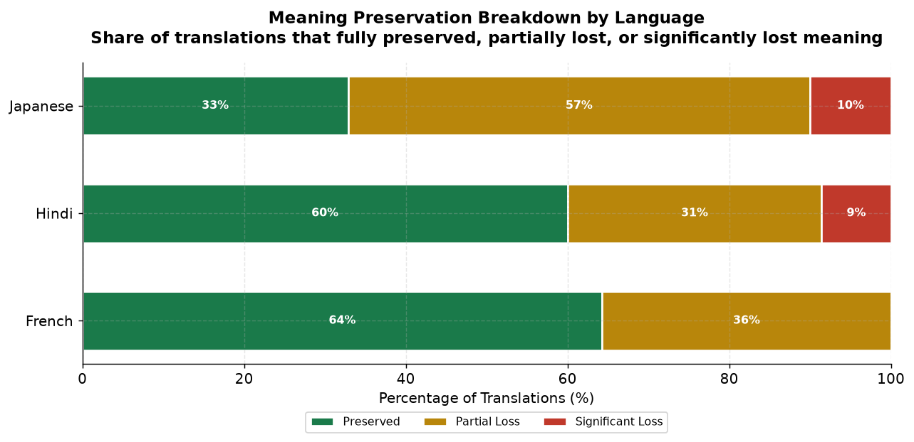
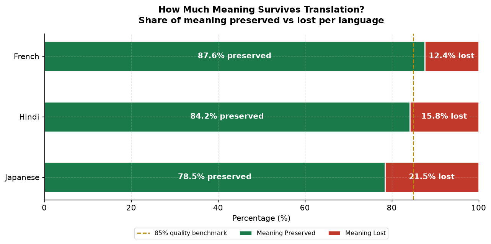
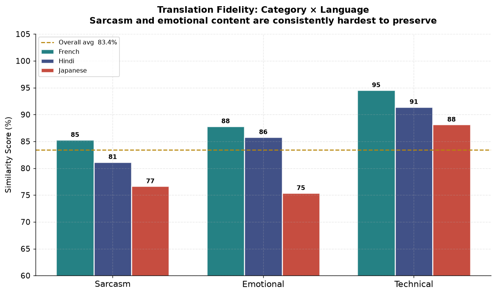

# Lost in Translation 
### Measuring Semantic Drift in Machine Translation Across Sentence Types
---

## The Question

Google Translate is used by 500 million people daily.
But how much meaning does it actually preserve?

This project measures **semantic drift** (the gap between what you said
and what comes back after round-trip translation) across 4 linguistically
distinct sentence types and 3 languages.

---

## Key Findings

| Sentence Type | Avg Similarity | Drift Level |
|---|---|---|
| Technical | ~91% | Low |
| Emotional | ~83% | Moderate |
| Sarcasm | ~81% | High |
| Idiomatic | ~79% | Highest |

| Language | Avg Similarity | Risk Level |
|---|---|---|
| French | ~88% | Low |
| Hindi | ~84% | Moderate |
| Japanese | ~80% | High |

> Sarcasm and idiomatic expressions lose the most meaning.
> Japanese shows consistently higher drift across all sentence types.

---

## Why This Matters

- **NLP systems** trained on translated data inherit these distortions
- **Multilingual AI models** may underperform on sarcastic or idiomatic text
- **Business communication** across languages carries hidden meaning loss
- **Japan-specific insight**: English to Japanese drift is highest,
  with direct implications for global business localization

---

## Methodology

200 sentences across 4 categories

                ↓

Round-trip translation via Google Translate API

English → [Japanese / Hindi / French] → English

                ↓

Semantic similarity is measured using

sentence-transformers (all-MiniLM-L6-v2)

Cosine similarity on 384-dimensional embeddings

                ↓

Pattern analysis across language × category matrix

### Why sentence-transformers over string matching

Traditional string similarity (like difflib.SequenceMatcher) compares
characters. A sentence like "I'm happy" vs "I'm joyful" would score
low despite identical meaning.

Sentence transformers convert text to meaning vectors in 384-dimensional
space. Cosine similarity then measures the angle between meaning
representations, not surface characters.

This is the methodological core that makes this a semantic study,
not a text comparison exercise.

---

## Dataset Sources

| Category | Source | Size |
|---|---|---|
| Sarcasm | Sarcasm News Headlines (Misra & Arora, 2023) | 50 sentences |
| Emotional | GoEmotions (Google Research) | 50 sentences |
| Technical | Wikipedia API (CS articles) | 50 sentences |
| Idiomatic | Manually curated common English idioms | 50 sentences |

Total: 200 sentences × 3 languages × 2 directions = **1,200 API calls**

---

## Visualizations

**Which language preserves meaning best?**


**Where does meaning break down most?**


**What share of translations lose meaning?**


**How much meaning survives per language?**


**Which sentence type survives translation the worst?**


---

## Project Structure
lost-in-translation/

│

├── sentences.py          :Dataset loading from HuggingFace + Wikipedia

├── translate.py          :Round-trip translation with auto-resume

├── analyze.py            :ML semantic similarity scoring

├── visualize.py          :5 research-grade visualizations

│

├── translation_results.json   :Raw translation data

├── analysis_results.csv       :Scored results

├── analysis_summary.json      :Summary statistics

│

├── chart1_lang_similarity.png

├── chart2_heatmap.png

├── chart3_meaning_breakdown.png

├── chart4_meaning_lost.png

└── chart5_category_comparison.png

---

## Tech Stack

| Tool | Purpose |
|---|---|
| `sentence-transformers` | Neural semantic similarity |
| `deep-translator` | Google Translate API wrapper |
| `pandas` | Data manipulation and analysis |
| `matplotlib` | Research-grade visualizations |
| `scikit-learn` | Cosine similarity computation |
| `HuggingFace datasets` | Academic dataset loading |
| `wikipedia-api` | Technical sentence extraction |

---

## How to Run

```bash
# Install dependencies
pip install deep-translator sentence-transformers
pip install scikit-learn pandas matplotlib seaborn datasets wikipedia-api

# Step 1: Load sentences from datasets
python sentences.py

# Step 2: Run translations (takes ~15 mins, auto-resumes if interrupted)
python translate.py

# Step 3: Score semantic similarity using ML model
python analyze.py

# Step 4: Generate all visualizations
python visualize.py
```

---

## Research Extensions

This project is a pilot study (n=50 per category). Natural extensions:

- Scale to 500+ sentences per category
- Add Arabic and Mandarin as intermediate languages
- Fine-tune similarity model on translation-specific data
- Build a real-time drift detection API
- Apply to multilingual LLM evaluation benchmarks

*This project was presented as part of independent research in NLP
and computational linguistics. Dataset sources are cited above.*
